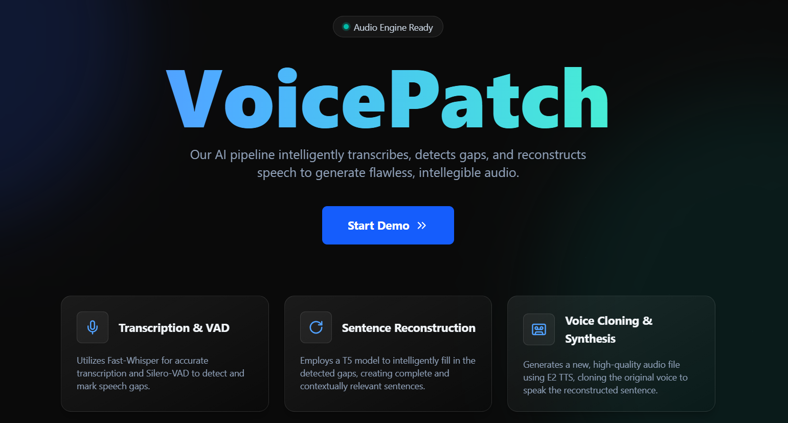

# VoicePatch

VoicePatch is an end-to-end speech inpainting pipeline that leverages voice activity detection, transformer-based language modeling, and voice-cloned TTS to restore semantically coherent segments in degraded audio.

## Usage Instructions
Download this repository
```
git clone https://github.com/Voice-Patch/VoicePatch.git
```
### Server Setup
```
cd backend
```
```
pip install torch torchvision torchaudio --index-url https://download.pytorch.org/whl/cu128

pip install -r requirements.txt
```

**Make sure ffmpeg is installed**

```
uvicorn main:app --reload --port 8000
```

### Frontend

```
cd frontend
```
```
npm install

npm run dev
```
**The frontend application should now be running at**
`http://localhost:5173`


## Workflow


## Gallery



## Authors
- [Ashish Adhikari](https://github.com/Aashish1-1-1)  
- [Swastik Aryal](https://github.com/Swastik-Aryal)  
- [James Bhattarai](https://github.com/jamesii-b)  
- [Rikesh Panta](https://github.com/RiCEmare)
- [Kritan Rijal](https://github.com/justfoolingaround)

